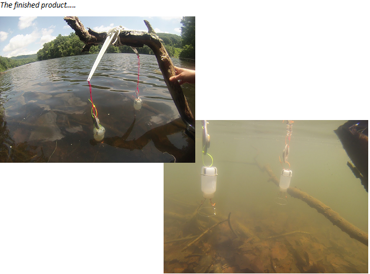

# Recruitment Trap Installation & Sampling SOP
*Last updated 12 Jul. 2016 by MEL*

### Principles/Background:  

Recruitment of vegetative cysts from the sediments to the water column can be an important contributor to pelagic phytoplankton populations.  The percent contribution of recruitment to pelagic populations can vary widely, from <2% to about 50%, depending on the system and species in question.  Our traps are designed to quantify recruitment from sediments in the littoral zone, and thus are suspended about 20 cm. above the sediments.  The idea is that cells leaving the sediments will float up into the mouth of the funnel and then travel up through the funnel tube into the bottle affixed to the top of the funnel.  Bottles can then be removed and their contents preserved and stored for later microscopic analysis.  It is important to suspend traps close to the settlement to minimize lateral transfer of cells into the traps through water movement.  It is also important to avoid disturbing the sediments when installing traps, since this could release cells from the sediments and lead to artificially high recruitment values.

### Materials: 

-	Glass funnels
-	250 mL HDPE white bottles filled with tap water
-	250 mL HDPE bottle lids modified w/ three hooks to fasten onto wide end of funnel and a hole in center for funnel tube [insert pic eventually]
-	Weights
-	Zipties
-	90° hangers
-	Rope (lightweight but strong)
-	Squirt bottle filled with tap water
-	Scissors
-	Crown-like spring-loaded attachment rings
-	Goggles and snorkel
-	Extra parts for all of the above
-	Toolbox 
-	Meter stick or other tape measure

### Installation Procedure:  

#### BEFORE INSTALLATION DAY

**1.** Select littoral zone sites suitable for recruitment trap installment.  It is easiest to hang recruitment traps from existing treefalls or overhanging branches because then they can be installed without dropping a heavy anchor into the sediments and disturbing them.  Thus, you can start collecting data immediately rather than having to give the traps a “settling period.”  Sites should be at least a meter deep and traps should not be installed directly over a rock or some other obvious obstacle to recruitment.

**2.** Pre-assemble traps.  Lash weights to bottle-holders with zipties.  Attach modified bottle lids with elastic hooks to funnels. 

#### ON INSTALLATION DAY

**1.** Prepare a calibration rope and demo bottle (see illustration below).  This could also be done beforehand.

**2.** Lash hanger to branch with rope.  Ensure it is secure enough to withstand thunderstorms.

**3.** Attach hanging string to weight/bottle-holder with zipties.  

**4.** Insert calibration rope and demo bottle into bottle-holder.

**5.** Thread hanging rope through hole at one end of hanger.

**6.** Don goggles.

**7.** Adjust the trap until the weight on the calibration rope is barely resting in the sediments and you are confident that the mouth of the funnel will be about 20 cm. above the sediments.

**8.** Attach glass funnel to a bottle filled with tap water and replace demo bottle with actual recruitment trap.

**9.** Repeat for duplicate trap from other side of hanger.

**10.** Pat yourself on the back for a job well done. 

### Sampling Procedure:  

#### BEFORE SAMPLING DAY

**1.**	Prepare replacement 250 mL HDPE clear bottles (fill with tap water).  
**2.**	Prepare 250 mL dark sample bottles (label and prep with Lugol’s).  
**3.**	Prepare replacement funnels.  
**4.**	Collect other materials:

* Squirt bottle with tap water
* Extra parts just in case
* Goggles

#### ON SAMPLING DAY  
**1.** Carefully approach the recruitment trap, taking care not to bump the trap or disturb the sediments with the boat.

**2.**	Reach into the water and plug the funnel with your finger.  If you can’t reach it, move the funnel VERY slowly to a position where you can reach it so as to minimize contamination of the samples.

**3.**	Bring up the trap and pour the contents of clear trap bottle into prepped dark sample bottle.  Try to avoid overflowing when pouring into the sample bottle; Lugol’s is designed to kill and preserve aquatic life, and you don’t want to dump it in the reservoir or all over yourself.   However, don’t panic if you spill a little bit of the sample when pouring; we are working from a known sample volume, so assuming the sample is homogenized in the bottle, a loss of a few milliliters is not the end of the world.

**4.**	Replace both the trap bottle and funnel and replace trap in the water; bring old bottle and funnel back to lab for cleaning.

**5.**	Repeat for the duplicate trap.

**Sources:**  

* Carey, C.C., K.C. Weathers, H.A. Ewing, M.L. Greer, and K.L. Cottingham. 2014. Spatial and temporal variability in recruitment of the cyanobacterium Gloeotrichia echinulata in an oligotrophic lake.  Freshwater Science.  33: 577-592.  
* Kate Hamre, phytoplankton ecologist extraordinaire
